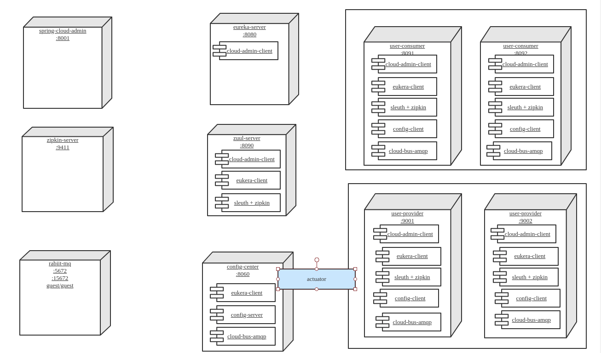

# Lab Goal

# Lab Current Status

## spring cloud config
### lookup config server
* via config server url
* via auto discovery using eureka
### refresh config data from github
* actuator/refresh
* actuator/bus-refresh
API bus-refresh can be invoked from any nodes where they include actuator and bus-amqp

After bus-refresh, all user-consumers and user-providers' configuration values are updated

